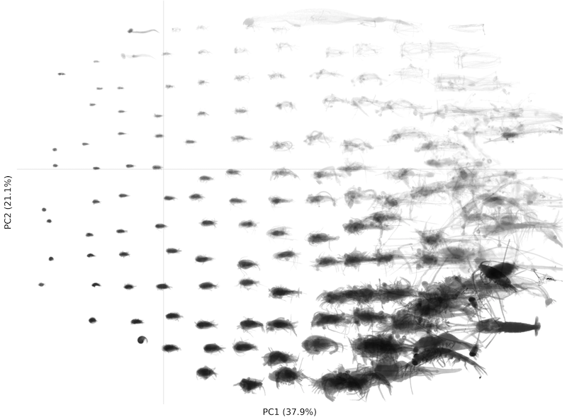

# morphr

R package to describe the morphological variations and create "morphotypes" from greyscale images

## Installation

`morphr` is not on CRAN yet, install it from this github repository with

```
remotes::install_github("jiho/morphr")
```

## Usage

Use `img_read()` and `img_show()` to read and display images.

Use `morphospace()` to create a morphological space, i.e. a description of the morphological features of the images on a n-dimensional space, through a Principal Component Analysis.

Use `morph()` to "morph" (i.e. fuse) several images into one, which is representative of the original batch of images.

Use `ggimg_grid()`, `ggmorph_radial()`, `ggmorph_tile()` to display several images and describe a morphological space by displaying morphs at regular locations in that space.



*Two first axes of a morphospace for planktonic organisms, with larger organisms on the right and darker organisms at the bottom.*